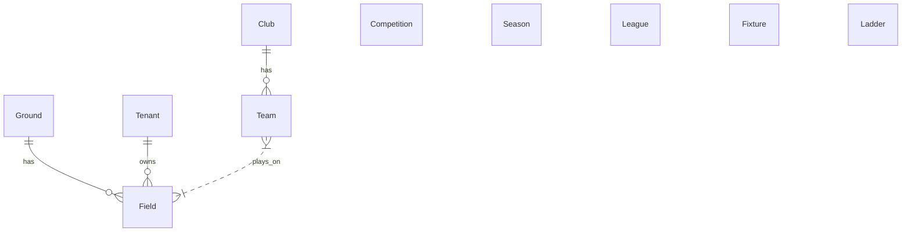

# APIDRIBL #

I am trying to document the public API of dribl.com

the swagger is presented here: https://data-monkey.github.io/apidribl/#/

the dribl app has many concepts that need to be related to each other. 

I am still working out the relationships ...
