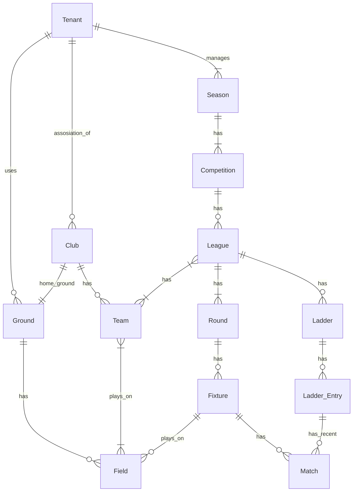

# API DRIBL #

I am trying to document the public API of dribl.com

__mc-api.dribl.com__ seems to be the public api  
__api.dribl.com__ is private

I have documented whatever I found in OpenAPI notation and presetned it here:    
<b>https://data-monkey.github.io/apidribl/</b>

The public api has many endpoints based around the needs of the public websites that dribl provides. I have mostly ignored these endpoints and focused on the data related ones 
Website exampeles are:
- https://mwfa.dribl.com/   Manly Warringha Football Association
- https://competitions.footballnsw.com.au/ Football NSW  

## Entities ##
Dribl uses many concepts that need to be related to each other. 

I am still working out the relationships ...
